<h1 align="center">Hi 👋, I'm Alaa Sedeeq </h1>

- 🔭 I'm learning Data Science.
- 📄 Know about my experiences look at my [CV](https://drive.google.com/file/d/14g_82a2ZqgZcz9_yddDo5XN73Ljd4xm5/view?usp=sharing)
- 🤔 Looking to collaborate on Machine Learning Project.
- 📫 Feel free to [Email](mailto:sedeeq.alaa@gmail.com) Me!
- 🌱 I’m currently working as a freelancer at UpWork
<!-- 
 
  Visitors: 
  

 -->

</img>

<!-- <h3 align="left">Connect with me:</h3>

 -->
<!--  -->
<!--  -->
<!--  -->

  
  

  
    

## Follow Me At

&nbsp;&nbsp;&nbsp;&nbsp;
&nbsp;&nbsp;&nbsp;&nbsp;
&nbsp;&nbsp;&nbsp;&nbsp;

  
<b>Thank's for visiting my Github Profile ❤️</b>

